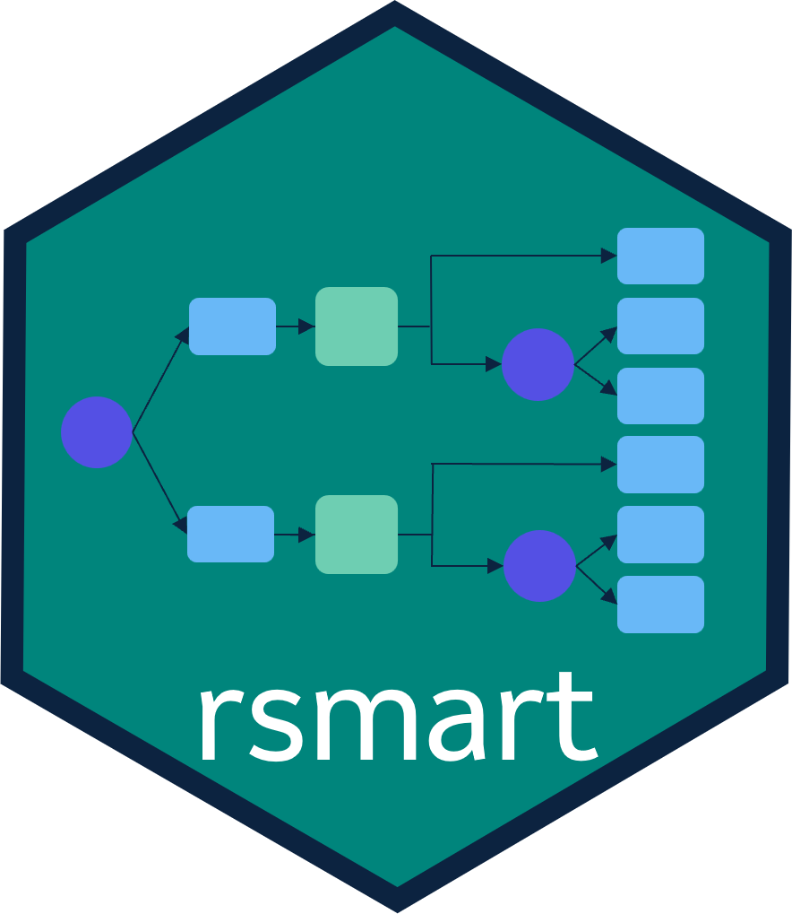

# rsmart 

rsmart is an R package to plan and analyze sequential multiple assignment randomized trials (SMARTs)

## Installation

```r
install.packages("rsmart")
```

Alternatively, to use a new feature or get a bug fix,
you can install the development version of rsmart from GitHub:

```r
# install.packages("remotes")
remotes::install_github("MSDLLCpapers/rsmart")
```

## Overview 

The `rsmart` package is intended to provide a common package for analyzing SMARTs with normal, binary, and time-to-event endpoints. 
The current build implements the inverse-probability weighted estimator, augmented IPWE and interim AIPWE of [Wu, Wang, and Wahed](https://onlinelibrary.wiley.com/doi/full/10.1111/biom.13562), [Zhang, Tsiatis, Laber and Davidian](https://academic.oup.com/biomet/article/100/3/681/303040?login=true), and [Manschot, Laber, and Davidian](https://onlinelibrary.wiley.com/doi/full/10.1111/biom.13854). 
It provides a convenient structure to implement any of these estimators for continuous (asymptotically normal) endpoints. 

If you're new to SMARTs and want to read a high-level overview of the key concepts involved, see our vignette titled "Getting Started with SMARTs." 

If you want to see an example of how the `rsmart` package can be used to implement the inverse probability weighted estimator (IAIPWE) approach, see the vignette titled "Full demo of IAIPWE." 

## Future Developments

We anticipate future developments to include: 

 - Binary and TTE endpoints design features
 - Hazard ratio estimation and global chi-square statistics for TTE endpoints
 - Additional examples

If you are interested in contributing, suggest an issue or open a pull request for review. 