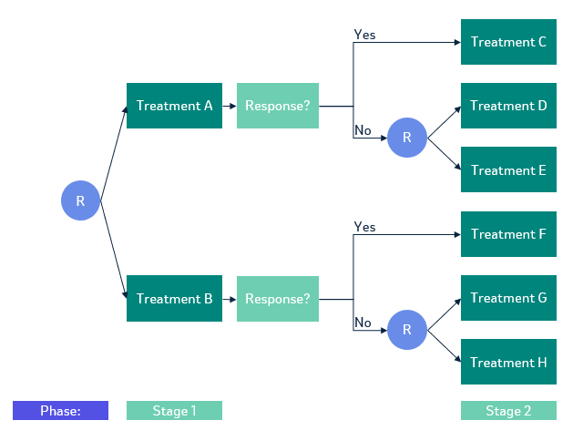

```{r setup, include=FALSE}
knitr::opts_chunk$set(
  collapse = TRUE,
  comment = "#>"
)

run <- requireNamespace("dplyr", quietly = TRUE) 
knitr::opts_chunk$set(eval = run)
```


## Introduction

The interim augmented inverse probability weighted estimator (IAIPWE) is a method for estimating the value of a regime in a sequential multiple assignment randomized trials (SMARTs). 
It provides a way to estimate the value of a treatment regime by combining data from multiple stages of treatment assignment.
This vignette demonstrates how to compute values using the IAIPW estimator with the `rsmart` package in R.
We also show how the package can be used to compute the values of a regime at a final or single analysis and how to compute the value of a regime using the inverse probability weighted estimator (IPWE). 
Our package implements the value estimator proposed by @manschot2023interim, which subsumes the estimator of @wu2023interim.

## An example SMART

A SMART randomized participants at each key decision point. 
The treatments available to a participant at each decision point may be based on their previous treatments or history. 
We consider a common two-stage SMART where participants are randomized to one of two treatments at the first stage. 
At the second stage, non-responders are randomized to one of two treatments based on their response to the first treatment and responders receive their second-stage treatment deterministically.
This allows us to demonstrate the feasible sets framework in the implementation. 

```{r trial design, echo=FALSE, fig.cap="SMART where only non-responders are re-randomized", fig.align="center", out.width="90%"}

```

We are interested in estimating the value or mean expected outcome of the embedded regimes in the SMART.
A regime is a set of rules that assigns treatments to participants at each key decision point. 
The above SMART has four embedded regimes, which are sets of rules that are built into the trial design.
They each follow the same rule structure, give *intervention 1*, if response give *intervention 2*, if non-response give *intervention 3*. 
If we use a canonical approach to enumerating the embedded regimes, the first embedded regime is give Treatment A, if response, give Intervention C, if non-response give Intervention D. 

## The sample data

We assume that the outcome `y` is a continuous variable encoded so that higher values are better.
The treatment assignments are coded as `a1` and `a2` for the first and second stages, respectively.

We observe two baseline covariates, $x_{11}$ and $x_{12}$, at the first stage and two additional covariates, $x_{21}$ at the second stage.
A response status `r2` is observed prior to the second stage treatment assignment.

We use `gen_no_trt_resp` to generate our sample data from the two-stage SMART.
The function `regime_list_no_trt_resp` will return a list of lists.
The first level of the list corresponds to the embedded regimes we are interested in estimating. 
The second level of the list corresponds to the treatment assignments an individual would have received if they followed that regime and whether that individual received treatments consistent with that regime at each stage. 

```{r load packages, message=FALSE, warning=FALSE}
library(rsmart)
```

```{r data}
# This code block is used to generate the dataset used in the vignette. 
set.seed(1)
dat <- gen_no_trt_resp(n=300, s2=200, block_rep=2, r2p = 0.5)
regimes <- regime_list_no_trt_resp(emb_regimes = list(c(0,0), c(0,1), c(1,0), c(1,1)), 
                                  dat = dat, 
                                  resp_trt = list("r2" = list(0, 0, 0, 0)))
```


## Computing the IPWE

We begin with the IPWE and build to the IAIPWE as the complexity of the esimation increases with the addition of augmentation terms and interim analyses. 

Currently, there is no option to use known randomization probabilities for the estimation procedure. 
This is omitted as the IPWE is known to be statistically more efficient when the randomization probabilities are estimated from the data (@tsiatis2006semiparametric). 

We can use the following models to model the treatment assignment probabilities at stage 1 and stage 2. 

```{r pi models}
p1 <- modelObj::buildModelObj(model = ~ 1,
                              solver.method = 'glm',
                              solver.args = list(family='binomial'),
                              predict.method = 'predict.glm',
                              predict.args = list(type='response'))

p2 <- modelObj::buildModelObj(model = ~ I(a1==0):I(r2==0) -1,
                              solver.method = 'glm',
                              solver.args = list(family='binomial'),
                              predict.method = 'predict.glm',
                              predict.args = list(type='response'))

pi_list <- list(p1, 
                p2)
```

The stage 1 model uses an intercept-only model to estimate the probability of $A_1=1$. 
The stage 2 model uses the interaction between the initial treatment and response status to estimate the probability of $A_2=1$ based on initial treatment and response status. 
This stage 2 model can be used for SMARTs that re-randomize both responders and non-responders as well. 

We also need to generate the proposed treatments and consistency indicators for the four regimes of interest. 
We encode the embedded regimes separately for responder treatments and non-responder treatments. 
This leads to encoding treatments A, C, D, F, and H as $0$ and treatments B, E, and H as $1$. 

```{r regimes}
regime_all <- regime_list_no_trt_resp(emb_regimes = list(c(0,0), c(0,1), c(1,0), c(1,1)), 
                       dat, 
                       resp_trt=list("r2" = list(0, 0, 0, 0)))
```


To calculate the values using the IPWE, we specify `q_list = NULL` to indicate that no augmentation terms will be used for computation. 
We also set `t_s = max(dat$t3)` to indicate that we want to compute the values at the ''final analysis'' time point. 

```{r ipwe}
ipweres <- iaipwe(df=dat, 
                  pi_list=pi_list, 
                  q_list=NULL, 
                  regime_all=regime_all, 
                  feasible_sets_indicator=TRUE, 
                  t_s=max(dat$t3)) 
```

Then we can extract the values from the results along with calculating the standard errors and confidence intervals.

```{r ipwe value}
ipweres$values
ipweres$se
```

If you wanted to construct a test to determine if any two regimes are different, you can use the covariance matrix $V_n$ returned by the `iaipwe` function.
The covariance returned by the function is the covariance of all estimated parameters following @manschot2023interim, so it must first be subset to just those of the value estimates. 


```{r ipwe diff}
cont.mat <- matrix(data = c(1, 0, 0, -1, 
                0, 1, 0, -1, 
                0, 0, 1, -1), 
       nrow = 3, byrow=TRUE)
endi <- dim(ipweres$covariance)[2]
starti <- endi - length(ipweres$values) + 1
covvhat <- ipweres$covariance[starti:endi, starti:endi] / ipweres$nus$ns

chisq <- t(cont.mat %*% ipweres$values) %*% 
  (solve(cont.mat %*% covvhat %*% t(cont.mat))) %*% 
  (cont.mat %*% ipweres$values)
pchi <- 1-pchisq(q = chisq, df = 3)

```

The observed $\chi^2$ statistic is `r round(chisq, 3)` and the p-value is `r round(pchi, 3)`.

The confidence intervals for the value of each regime can also be constructed using the standard errors. 

```{r ipwe ci}
alpha <- 0.05
ci <- data.frame(
  regime = seq(1, 4),
  value = round(ipweres$values, 3),
  lower = round(ipweres$values - qnorm(1-alpha/2) * ipweres$se, 3),
  upper = round(ipweres$values + qnorm(1-alpha/2) * ipweres$se, 3)
)
ci
```


## Computing the AIPWE

To compute the AIPWE, we need to propose Q-functions for stage 1 and stage 2. 
When these models are correctly specified or the observed covariates are correlated with the outcome, the augmentation terms help increase the statistical efficiency of the estimator. 
This comes at the trade off of a slight increase in computation time. 
These models can be specified using the `modelObj` package.

The Q-function at each stage should only use information available prior and at that stage. For example, the Q-function at stage 1 should not use the response status which is observed at stage 2. 

```{r q models}
q2 <- modelObj::buildModelObj(model = ~ x11 + x12 + x21 +
                                a1 + a2 + a1:a2 + r2,
                              solver.method = 'lm',
                              predict.method = 'predict.lm')
q1 <- modelObj::buildModelObj(model = ~ x11 + x12 + 
                                a1,
                              solver.method = 'lm',
                              predict.method = 'predict.lm')
q_list <- list(q1, q2)
```

We then replace the previous `NULL` argument for `q_list` with our updated list and re-run our analyses. 

```{r aipwe}
aipweres <- iaipwe(df=dat, 
                  pi_list=pi_list, 
                  q_list=q_list, 
                  regime_all=regime_all, 
                  feasible_sets_indicator=TRUE, 
                  t_s=max(dat$t3)) 
```

Then we can extract the values from the results along with calculating the standard errors and confidence intervals.

```{r aipwe value}
aipweres$values
aipweres$se
```

We can see that the AIPWE is more efficient than the IPWE as the standard errors are smaller.

We re-compute the $\chi^2$ test-statistic and corresponding p-value. 

```{r aipwe diff}
endi <- dim(aipweres$covariance)[2]
starti <- endi - length(aipweres$values) + 1
covvhat <- aipweres$covariance[starti:endi, starti:endi] / aipweres$nus$ns

chisq <- t(cont.mat %*% aipweres$values) %*% 
  (solve(cont.mat %*% covvhat %*% t(cont.mat))) %*% 
  (cont.mat %*% aipweres$values)
pchi <- 1-pchisq(q = chisq, df = 3)

```

The observed $\chi^2$ statistic is `r round(chisq, 3)` and the p-value is `r round(pchi, 3)`.

With the increase precision, the observed chi-squared test statistic is larger and the p-value smaller than the results from the IPWE. 

The confidence intervals for the values of each of the regimes are accordingly more narrow with this efficiency gain. 

```{r aipwe ci}
ci <- data.frame(
  regime = seq(1, 4),
  value = round(aipweres$values, 3),
  lower = round(aipweres$values - qnorm(1-alpha/2) * aipweres$se, 3),
  upper = round(aipweres$values + qnorm(1-alpha/2) * aipweres$se, 3)
)
ci
```


## Computing the IAIPWE

To compute the IAIPWE, we need to specify the time point at which we want to compute the values. 
We will use when approximately half of the participants have had their final outcome observed.

```{r iaipwe}
iaipweres <- iaipwe(df=dat, 
                  pi_list=pi_list, 
                  q_list=q_list, 
                  regime_all=regime_all, 
                  feasible_sets_indicator=TRUE, 
                  t_s=median(dat$t3))
```

Again, we extract the values, standard errors, test statistic, and confidence intervals. 

```{r aipwe results}
iaipweres$values
iaipweres$se

endi <- dim(iaipweres$covariance)[2]
starti <- endi - length(iaipweres$values) + 1
covvhat <- iaipweres$covariance[starti:endi, starti:endi] / iaipweres$nus$ns

chisq <- t(cont.mat %*% iaipweres$values) %*% 
  (solve(cont.mat %*% covvhat %*% t(cont.mat))) %*% 
  (cont.mat %*% iaipweres$values)
pchi <- 1-pchisq(q = chisq, df = 3)

ci <- data.frame(
  regime = seq(1, 4),
  value = round(iaipweres$values, 3),
  lower = round(iaipweres$values - qnorm(1-alpha/2) * iaipweres$se, 3),
  upper = round(iaipweres$values + qnorm(1-alpha/2) * iaipweres$se, 3)
)
ci

```

Because this analysis is performed using only part of the total information available, we see that the standard errors are larger than those of the AIPWE. 
However, the analysis is performed at time `r median(dat$t3)` instead of at time `r max(dat$t3)`, which is the final analysis time point.
As such, it only uses `r iaipweres$nus$ns` participants, which is less than the planned `r ipweres$nus$ns` total participants.

When testing for a difference between the embedded regimes, the observed $\chi^2$ statistic is `r round(chisq, 3)` and the p-value is `r round(pchi, 3)`.  

## References

